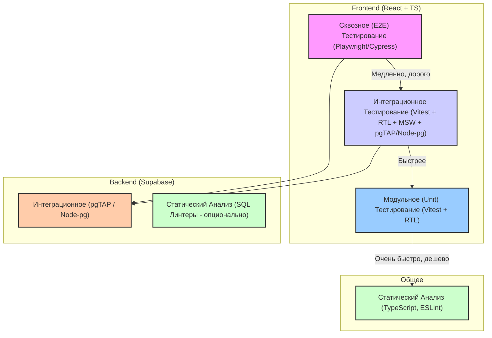

# Clicker Game - Стратегия Тестирования

## 1. Введение

Этот документ описывает стратегию тестирования для веб-приложения "Clicker Game". Цель - обеспечить качество, надежность и корректность работы приложения путем внедрения современных практик тестирования.

## 2. Цели Тестирования

*   **Корректность Функциональности:** Убедиться, что все функции приложения (игра, аутентификация, управление сессиями, отображение результатов) работают в соответствии с требованиями.
*   **Надежность:** Гарантировать стабильную работу приложения при различных условиях и пользовательских сценариях.
*   **Производительность:** (Второстепенно для текущего этапа, но важно для будущего) Убедиться, что приложение отзывчиво, особенно таймер и обработка кликов.
*   **Безопасность:** Проверить корректность работы аутентификации и правил доступа к данным (RLS в Supabase).
*   **Пользовательский Опыт (UX):** Убедиться, что интерфейс интуитивно понятен, адаптивен и соответствует ожиданиям.

## 3. Уровни Тестирования и Инструменты

Мы будем использовать многоуровневый подход ("Пирамида тестирования"):

### 3.1. Статический Анализ

*   **Инструменты:** TypeScript, ESLint (уже настроены).
*   **Цель:** Отлов ошибок типов, стиля кода, потенциальных проблем на этапе разработки.
*   **Область:** Весь TypeScript/JavaScript код (`.ts`, `.tsx`).

### 3.2. Модульное (Unit) Тестирование

*   **Инструменты:**
    *   Тест-раннер: **Vitest** (интегрируется с Vite).
    *   Библиотека для компонентов: **React Testing Library (RTL)** (`@testing-library/react`).
    *   Mocking: Встроенные возможности Vitest (`vi.fn`, `vi.mock`).
*   **Цель:** Тестирование изолированных частей кода (функции, хуки, компоненты) с mock-зависимостями.
*   **Область:**
    *   **Утилиты (`src/utils/`):** Функции `gameUtils.ts`, `timeUtils.ts`. Проверка чистых функций с разными входными данными.
    *   **Хуки (`src/hooks/`):** Тестирование логики внутри хуков (`useTimer`, `useGameSession`, `useTheme`). Зависимости (например, `Date`, `setTimeout`, Supabase client) будут мокироваться.
    *   **Состояние (`src/store/`):** Тестирование редьюсеров/действий и селекторов Zustand (`auth.ts`, `game.ts`).
    *   **Простые Компоненты (`src/components/`):** Тестирование рендеринга простых компонентов и их реакции на пропсы (например, `ParticlesBackground`, возможно, части `AttemptsTable`, `GameStats` без сложной логики).

### 3.3. Интеграционное Тестирование

*   **Инструменты:**
    *   Тест-раннер: **Vitest**.
    *   Библиотека для компонентов: **React Testing Library (RTL)**.
    *   Mocking API: **Mock Service Worker (MSW)** для имитации ответов Supabase API (Auth, Functions, DB).
    *   Тестирование БД (опционально, но рекомендуется): **pgTAP** (если используется Supabase CLI локально/в CI) или тесты на **Node.js + `pg`** для проверки функций PL/pgSQL и RLS.
*   **Цель:** Проверка взаимодействия между несколькими модулями frontend, а также взаимодействия frontend с mock-backend или реальной (тестовой) базой данных.
*   **Область:**
    *   **Компоненты и Хуки:** Тестирование компонентов, использующих хуки и состояние Zustand (`Game`, `AuthForm`, `AttemptsTable`, `GameStats`, `useGameSession`).
    *   **Frontend <-> Backend:** Тестирование потоков данных между UI и mock-сервисом Supabase (регистрация, вход, отправка попытки, получение статистики).
    *   **Backend Логика (PL/pgSQL):** Тестирование функций Supabase (`record_attempt`, `calculate_smiles` и т.д.) и политик RLS напрямую в тестовой БД.

### 3.4. Сквозное (End-to-End - E2E) Тестирование

*   **Инструменты:** **Playwright** (предпочтительнее из-за лучшей интеграции с Vite/Vitest и возможностей) или **Cypress**.
*   **Цель:** Валидация полных пользовательских сценариев в реальном браузере, имитируя действия пользователя.
*   **Область:**
    *   **Аутентификация:** Регистрация -> Вход -> Выход.
    *   **Игровой Цикл:** Вход -> Начало сессии -> Несколько кликов -> Просмотр таблицы попыток -> Завершение сессии (попытки/время) -> Просмотр лучшего результата -> Начало новой сессии после кулдауна.
    *   **Вспомогательные функции:** Открытие модального окна правил, переключение темы.

## 4. Стратегия Реализации

1.  **Настройка Окружения:**
    *   Установить `vitest`, `@testing-library/react`, `@testing-library/jest-dom`, `jsdom`, `msw`.
    *   Настроить конфигурацию Vitest (`vite.config.ts` или `vitest.config.ts`).
    *   Настроить MSW для перехвата запросов к Supabase.
    *   (Опционально) Настроить окружение для тестирования БД (Supabase CLI + Docker, pgTAP).
    *   Установить и настроить Playwright/Cypress.
2.  **Написание Тестов (Итеративно):**
    *   **Unit Тесты:** Начать с утилит (`utils`), затем хранилища (`store`), хуков (`hooks`), простых компонентов.
    *   **Integration Тесты (Frontend):** Тестировать взаимодействие компонентов, хуков и состояния. Настроить MSW для имитации Supabase.
    *   **Integration Тесты (Backend - опционально):** Написать тесты для функций PL/pgSQL и RLS.
    *   **E2E Тесты:** Покрыть основные пользовательские сценарии.
3.  **Интеграция с CI/CD:**
    *   Добавить шаги для запуска тестов (linting, unit, integration, e2e) в пайплайн CI/CD (например, GitHub Actions).

## 5. Приоритеты

1.  **Unit/Integration тесты для ключевой логики:** `utils`, `store`, `hooks` (`useGameSession`, `useTimer`), основные компоненты (`Game`, `AuthForm`).
2.  **E2E тесты для критических путей:** Аутентификация, основной игровой цикл.
3.  **Тестирование Backend логики** (если ресурсы позволяют).
4.  **Unit тесты для менее критичных компонентов.**

## 6. Метрики (Опционально)

*   **Покрытие Кода (Code Coverage):** Использовать встроенные возможности Vitest для отслеживания процента кода, покрытого тестами. Стремиться к разумному покрытию (например, >70-80% для ключевой логики), но не гнаться за 100% в ущерб качеству тестов.
*   **Количество пройденных/упавших тестов.**