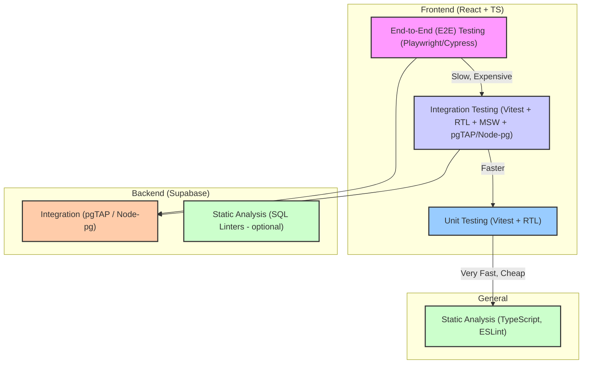

# Clicker Game - Testing Strategy

## 1. Introduction

This document outlines the testing strategy for the "Clicker Game" web application. The goal is to ensure the quality, reliability, and correctness of the application by implementing modern software testing best practices.

## 2. Testing Goals

*   **Functional Correctness:** Verify that all application features (gameplay, authentication, session management, results display) work according to requirements.
*   **Reliability:** Ensure the application operates stably under various conditions and user scenarios.
*   **Performance:** (Secondary for the current phase, but important for the future) Ensure the application is responsive, especially the timer and click handling.
*   **Security:** Verify the correctness of authentication and data access rules (RLS in Supabase).
*   **User Experience (UX):** Ensure the interface is intuitive, responsive (adaptive), and meets user expectations.

## 3. Testing Levels and Tools

We will employ a multi-layered approach (the "Testing Pyramid"):

### 3.1. Static Analysis

*   **Tools:** TypeScript, ESLint (already configured).
*   **Goal:** Catch type errors, code style issues, and potential problems during development.
*   **Scope:** All TypeScript/JavaScript code (`.ts`, `.tsx`).

### 3.2. Unit Testing

*   **Tools:**
    *   Test Runner: **Vitest** (integrates with Vite).
    *   Component Library: **React Testing Library (RTL)** (`@testing-library/react`).
    *   Mocking: Built-in Vitest capabilities (`vi.fn`, `vi.mock`).
*   **Goal:** Test isolated code units (functions, hooks, components) with mocked dependencies.
*   **Scope:**
    *   **Utilities (`src/utils/`):** Functions in `gameUtils.ts`, `timeUtils.ts`. Test pure functions with various inputs.
    *   **Hooks (`src/hooks/`):** Test logic within hooks (`useTimer`, `useGameSession`, `useTheme`). Dependencies (e.g., `Date`, `setTimeout`, Supabase client) will be mocked.
    *   **State (`src/store/`):** Test Zustand reducers/actions and selectors (`auth.ts`, `game.ts`).
    *   **Simple Components (`src/components/`):** Test rendering of simple components and their reaction to props (e.g., `ParticlesBackground`, possibly parts of `AttemptsTable`, `GameStats` without complex logic).

### 3.3. Integration Testing

*   **Tools:**
    *   Test Runner: **Vitest**.
    *   Component Library: **React Testing Library (RTL)**.
    *   API Mocking: **Mock Service Worker (MSW)** to simulate Supabase API responses (Auth, Functions, DB).
    *   DB Testing (optional, but recommended): **pgTAP** (if using Supabase CLI locally/in CI) or **Node.js + `pg`** tests to verify PL/pgSQL functions and RLS.
*   **Goal:** Verify interactions between multiple frontend modules, as well as frontend interaction with a mock backend or a real (test) database.
*   **Scope:**
    *   **Components and Hooks:** Test components that use hooks and Zustand state (`Game`, `AuthForm`, `AttemptsTable`, `GameStats`, `useGameSession`).
    *   **Frontend <-> Backend:** Test data flows between the UI and the mock Supabase service (registration, login, submitting attempts, fetching stats).
    *   **Backend Logic (PL/pgSQL):** Test Supabase functions (`record_attempt`, `calculate_smiles`, etc.) and RLS policies directly against a test database.

### 3.4. End-to-End (E2E) Testing

*   **Tools:** **Playwright** (preferred due to better integration with Vite/Vitest and features) or **Cypress**.
*   **Goal:** Validate complete user scenarios in a real browser, simulating user actions.
*   **Scope:**
    *   **Authentication:** Sign Up -> Login -> Logout.
    *   **Game Loop:** Login -> Start Session -> Make several clicks -> View attempts table -> End Session (attempts/time) -> View best result -> Start new session after cooldown.
    *   **Auxiliary Functions:** Opening the rules modal, switching themes.

## 4. Implementation Strategy

1.  **Environment Setup:**
    *   Install `vitest`, `@testing-library/react`, `@testing-library/jest-dom`, `jsdom`, `msw`.
    *   Configure Vitest (`vite.config.ts` or `vitest.config.ts`).
    *   Set up MSW to intercept Supabase requests.
    *   (Optional) Set up the database testing environment (Supabase CLI + Docker, pgTAP).
    *   Install and configure Playwright/Cypress.
2.  **Writing Tests (Iteratively):**
    *   **Unit Tests:** Start with utilities (`utils`), then stores (`store`), hooks (`hooks`), simple components.
    *   **Integration Tests (Frontend):** Test interactions between components, hooks, and state. Set up MSW to mock Supabase.
    *   **Integration Tests (Backend - optional):** Write tests for PL/pgSQL functions and RLS.
    *   **E2E Tests:** Cover the main user scenarios.
3.  **CI/CD Integration:**
    *   Add steps to run tests (linting, unit, integration, e2e) in the CI/CD pipeline (e.g., GitHub Actions).

## 5. Priorities

1.  **Unit/Integration tests for core logic:** `utils`, `store`, `hooks` (`useGameSession`, `useTimer`), main components (`Game`, `AuthForm`).
2.  **E2E tests for critical paths:** Authentication, main game loop.
3.  **Backend logic testing** (if resources allow).
4.  **Unit tests for less critical components.**

## 6. Metrics (Optional)

*   **Code Coverage:** Use Vitest's built-in capabilities to track the percentage of code covered by tests. Aim for reasonable coverage (e.g., >70-80% for core logic), but don't chase 100% at the expense of test quality.
*   **Number of passed/failed tests.**